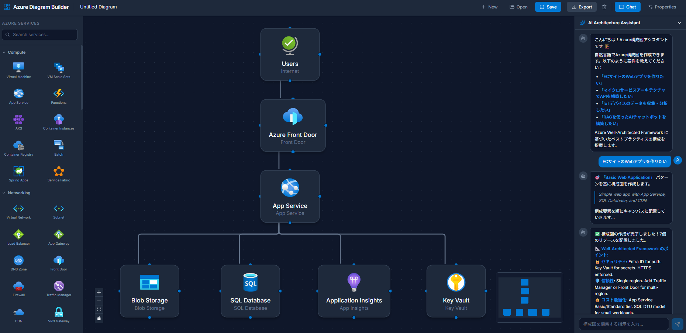

# Azure Diagram Builder

> **🚧 Work In Progress — 開発中のサンプルコードです 🚧**
>
> このプロジェクトはまだ開発途中です。機能追加・バグ修正・UIの改善を継続的に行っています。

Azure アーキテクチャ構成図をブラウザ上で作成できる Web アプリケーションです。  
ドラッグ＆ドロップで Azure サービスを配置し、自然言語チャットで構成図を自動生成できます。


## Screenshot



## Features

- **ドラッグ＆ドロップ**: サイドバーから 88 種類の Azure サービスをキャンバスに配置
- **AI チャット**: 自然言語で構成図を自動生成（例：「ECサイトのWebアプリを作りたい」）
- **8 種類のアーキテクチャパターン**: Well-Architected Framework に基づくベストプラクティス
- **接続線の編集**: ノード間を接続、クリックで選択、Delete キーで削除
- **保存 / 読み込み**: LocalStorage にダイアグラムを保存・復元
- **エクスポート**: PNG / SVG / JSON 形式で出力
- **ダーク UI**: モダンなダーク テーマ

## Architecture Patterns

| パターン | 説明 |
|---|---|
| Basic Web App | App Service + SQL Database + CDN |
| HA Web App | マルチリージョン + Front Door + Redis |
| Microservices | AKS + API Management + Cosmos DB |
| Serverless | Functions + Event Grid + Service Bus |
| Data Pipeline | Event Hub + Stream Analytics + Synapse |
| AI/ML App | OpenAI + AI Search + Cosmos DB (RAG) |
| IoT Solution | IoT Hub + Stream Analytics + ML |
| Hub-Spoke Network | VNET + Firewall + Bastion |

## Tech Stack

- **Frontend**: React 19 + Vite 8
- **Diagram**: [@xyflow/react](https://reactflow.dev/) (React Flow)
- **Export**: html-to-image + file-saver
- **Icons**: [Azure Architecture Icons](https://learn.microsoft.com/ja-jp/azure/architecture/icons/) (公式 SVG)
- **Agent** (experimental): Microsoft Agent Framework + Azure OpenAI
- **Test**: Vitest

## Getting Started

```bash
# Install dependencies
npm install

# Start dev server
npm run dev

# Run tests
npm test

# Build for production
npm run build
```

## Agent (Experimental)

```bash
# Create Python virtual environment
python -m venv .venv
.venv\Scripts\activate        # Windows
# source .venv/bin/activate   # macOS/Linux

# Install agent dependencies
pip install -r requirements-agent.txt

# Copy and edit environment variables
cp .env.example .env

# Run agent
python agent/main.py
```

## Project Structure

```
src/
├── App.jsx                 # Main application
├── components/
│   ├── AzureNode.jsx       # Custom React Flow node
│   ├── ChatPanel.jsx       # AI chat interface
│   ├── PropertiesPanel.jsx # Node properties editor
│   └── Sidebar.jsx         # Service catalog sidebar
├── data/
│   ├── azureServices.js    # 88 Azure service definitions
│   └── architecturePatterns.js  # 8 reference architecture patterns
├── engine/
│   └── conversationEngine.js    # NLP conversation engine
├── hooks/
│   ├── useDiagramStorage.js     # LocalStorage persistence
│   └── useToast.js              # Toast notifications
└── test/                   # Vitest test suites (73 tests)
public/icons/               # 88 official Azure SVG icons
agent/                      # Agent Framework agent (experimental)
skills/                     # Agent Framework skills
```

## License

MIT
